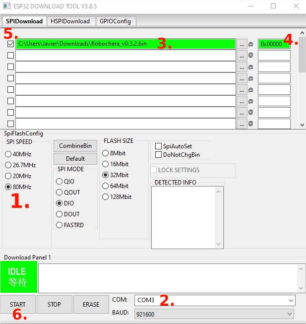
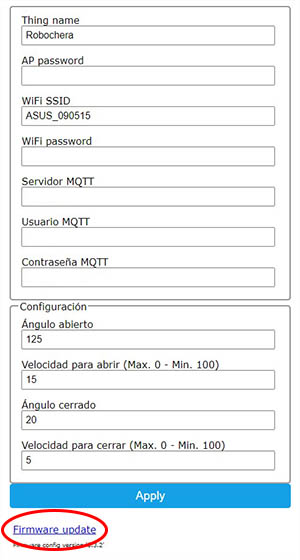

# Robochera
Robochera es un programa para microcontroladores ESP32 que permite el control de una puerta automática para robots aspiradores.

Gracias a dos servomotores que empujan una puerta con bisagras, puede abrir y cerrar la puerta para iniciar o terminar la limpieza. Esto permite tener oculto nuestro robot aspirador.

También controla una tira led WS2812B para decorar el proceso o indicar estados.

Genera entidades MQTT en Home Assistant para el control de la puerta automática y de una tira LED que se utiliza como indicador de estado.

## Requisitos

- ESP32 (No funciona con ESP8266).
- Home Assistant.
- Addon MQTT.
- [Robot aspirador integrado en Home Assistant](https://youtu.be/oR-j6311Xrc).

## Materiales

- 2x [Servomotores](https://amzn.to/399qmeb) de alto torque.
- 1x [ESP32 Dev Kit](https://amzn.to/2J6Xpo1).
- 1x [Tira LED WS2812B](https://amzn.to/2V74vvT) (16 LEDs). Opcional.

## Instalación

Existe dos formas para instalar la Robochera en un ESP32. Para procesos de nueva instalación en necesario utilizar una aplicación. Para actualizar, es proceso es mas rápido y simple

### Nueva instalación

Utiliza la aplicación [Flash Download Tools](https://www.espressif.com/en/support/download/other-tools) para grabar el último archivo bin de la sección de [Releases](https://github.com/fjramirez1987/Robochera/releases). Robochera_vx.x.x.bin.

Abre la aplicación y pulsa "Developer Mode" y luego en "ESP32 DownloadTool".

1. Configura SPI SEED a 80MHZ.
2. Elige el puerto COM correcto.
3. Selecciona el archivo .bin a grabar.
4. Establece la dirección 0x00000
5. Marca la casilla de verificación.
6. Pulsa START.
7. Mantén pulsado el botón boot en el ESP32 hasta que comience a grabar.
8. Cuando ponga FINISH puedes pulsar en STOP.
9. ¡LISTO!

### Actualización

En la configuración del dispositivo, pulsa "Firmware update" que encontrarás en la parte inferior. Debes cargar el último archivo bin de la sección de [Releases](https://github.com/fjramirez1987/Robochera/releases). Robochera_vx.x.x_update.bin.

## Configuración

Cuando se graba por primera vez en el ESP32 el firmware, se genera un punto de acceso "Robochera". La contraseña de acceso es:

    password: robochera32 

Debes conectarte a ese punto de acceso, y automáticamente se abrirá el navegador con la ventana de configuración.

Se requiere que cambies la contraseña por defecto del punto de acceso por una propia. Ademas, necesitas configurar los parámetros de tu red wifi y MQTT.

Una vez finalices esta configuración, pulsa en guardar y conéctate a tu red wifi. El ESP32 se debe conectar a tu red wifi automáticamente.

Puedes volver a esta configuración en cualquier momento accediendo a la IP del ESP32. Los datos de acceso son:

    usuario: admin
    password: "La configurada como AP password"

## Integrar en Home Assistant

De forma automática cuando se inicia el dispositivo Robochera se añaden a Home Assistant las entidades:

- Robochera Door
- Robochera Light

Debes poder verla en Integraciones -> MQTT -> Dispositivos -> Robochera

En el caso contrario, puedes añadir estas integraciones abriendo la dirección web:

    http://"IP_Robochera"/add

Se requiere que tengas instalado y configurado un servidor MQTT.